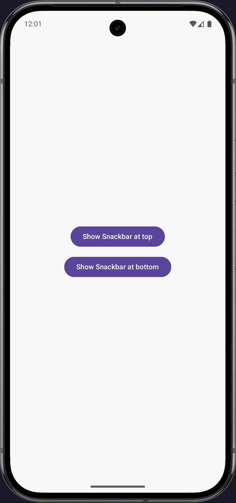
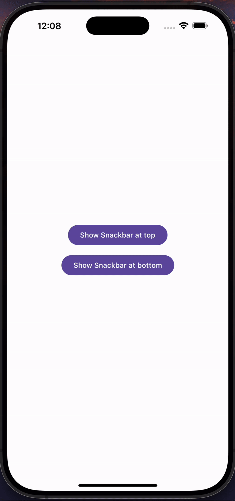
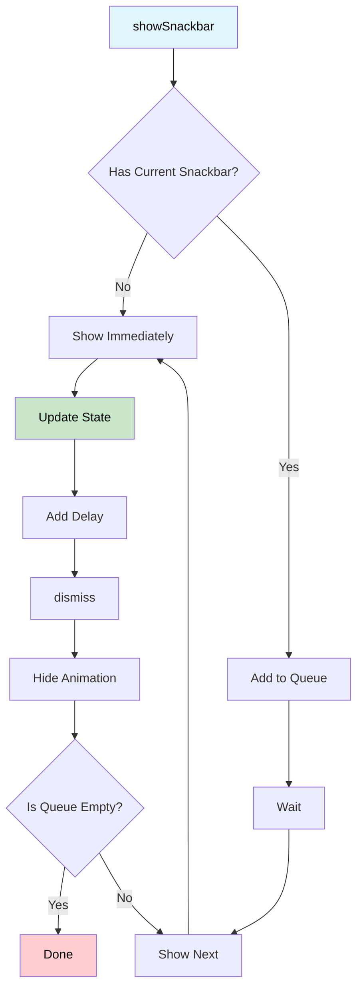

# Snackbar Manager Jetpack Compose

A modern and customizable snackbar implementation for Compose Multiplatform projects. A flexible and easy-to-use snackbar system that you can use across all platforms.

## Features

- 🎨 **Fully Customizable**: Control over colors, align, and content
- 📱 **Multiplatform Support**: Works wherever Jetpack Compose is available
- 🔄 **Animated Transitions**: Smooth slide-in/slide-out animations
- 📋 **Queue Management**: Automatic snackbar queue handling
- 🔧 **Action Button Support**: Optional action button integration
- 🎭 **Custom Layouts**: Create your own snackbar designs
- ⏱️ **Auto Dismiss**: Configurable auto-dismiss duration
- 🔒 **Thread Safe**: Concurrent snackbar requests handled safely

## Visuals

<div align="center">

| Customized | Default |
|:---:|:---:|
|  |  |

</div>

*Add real screenshots here for better visualization*

## Usage

### Basic Setup

Wrap your app's root composable with `SnackbarHostProvider`:

```kotlin
@Composable
fun App() {
  MaterialTheme {
    SnackbarHostProvider {
      // Your app content
      MainScreen()
    }
  }
}
```

### Showing Snackbars

To show a snackbar from any composable:

```kotlin
@Composable
fun MyScreen() {
  val snackbarManager = LocalSnackbarManager.current

  Button(
    onClick = {
      snackbarManager.showSnackbar(
        SnackbarData(
          message = "Operation successful!",
          color = Color.Green,
          align = SnackbarAlign.BOTTOM
        )
      )
    }
  ) {
    Text("Show Success Snackbar")
  }
}
```

### Different Snackbar Types

### Simple Snackbar

```kotlin
snackbarManager.showSnackbar(
  SnackbarData(
    message = "An error occurred!",
    color = Color.Red,
    align = SnackbarAlign.TOP
  )
)
```

### Snackbar with Action Button

```kotlin
snackbarManager.showSnackbar(
  SnackbarData(
    message = "File deleted",
    color = Color.Orange,
    action = {
      TextButton(
        onClick = { /* Undo action */ }
      ) {
        Text("UNDO", color = Color.White)
      }
    }
  )
)
```

### Snackbar with Dismiss Callback

```kotlin
snackbarManager.showSnackbar(
  SnackbarData(
    message = "Task completed",
    color = Color.Green,
    onDismiss = {
      println("Snackbar was dismissed!")
      // Perform cleanup or additional actions
    }
  )
)
```

### Custom Snackbar Design

Create your own snackbar design by extending `SnackbarConfig`:

```kotlin
class CustomSnackbarConfig : SnackbarConfig() {
  override val snackbarContent: SnackbarContent = { data, isVisible ->
    CustomSnackbarDesign(data, isVisible)
  }

  override val backgroundContent: SnackbarContent = { data, isVisible ->
    CustomBackgroundOverlay(data, isVisible)
  }
}

// Usage
SnackbarHostProvider(
  config = CustomSnackbarConfig()
) {
  // Your app
}
```

### Manual Dismissal

To manually dismiss the current snackbar:

```kotlin
val snackbarManager = LocalSnackbarManager.current

// Dismiss current snackbar
snackbarManager.dismiss()
```

### Advanced Usage

### Multiple Snackbars with Queue

```kotlin
// Show multiple snackbars - they will be queued automatically
repeat(3) { index ->
  snackbarManager.showSnackbar(
    SnackbarData(
      message = "Message ${index + 1}",
      color = when (index) {
        0 -> Color.Red
        1 -> Color.Blue
        else -> Color.Green
      }
    )
  )
}
```

## API Reference

### SnackbarData

```kotlin
data class SnackbarData(
  val message: String,                               // Message to display
  val color: Color = Color.Black,                   // Background color
  val durationMillis: Long = DEFAULT_SNACKBAR_DURATION, // Duration (2 seconds)
  val align: SnackbarAlign = SnackbarAlign.BOTTOM, // Position on screen
  val action: (@Composable RowScope.() -> Unit)? = null, // Optional action button
  val onDismiss: (() -> Unit)? = null              // Dismiss callback
)
```

### SnackbarAlign

```kotlin
enum class SnackbarAlign {
  TOP,    // Show at top of screen
  BOTTOM  // Show at bottom of screen (default)
}
```

### SnackbarManager

```kotlin
interface SnackbarManager {
  val currentSnackbar: State<SnackbarData?>  // Currently displayed snackbar
  val isVisible: State<Boolean>              // Visibility state

  fun showSnackbar(data: SnackbarData)       // Show a snackbar
  fun dismiss()                              // Dismiss current snackbar
}
```

### SnackbarConfig

```kotlin
abstract class SnackbarConfig {
  open val backgroundContent: SnackbarContent    // Background overlay content
  open val snackbarContent: SnackbarContent      // Main snackbar content
}
```

## Configuration

### Auto-Dismiss Duration

By default, snackbars auto-dismiss after 2 seconds. You can customize this per snackbar using the `durationMillis` parameter:

```kotlin
snackbarManager.showSnackbar(
  SnackbarData(
    message = "Custom duration message",
    durationMillis = 4000L // 4 seconds
  )
)
```

### Animation Timings

Entry and exit animations take 500ms by default. You can create your own customized snackbar and apply any animation you want based on the `isVisible` parameter:

```kotlin
@Composable
fun BoxScope.MyCustomSnackbar(
  data: SnackbarData,
  isVisible: Boolean
) {
  AnimatedVisibility(
    visible = isVisible,
    enter = fadeIn(animationSpec = tween(300)) +
            scaleIn(animationSpec = tween(300)),
    exit = fadeOut(animationSpec = tween(200)) +
            scaleOut(animationSpec = tween(200))
  ) {
    // Your custom snackbar design
  }
}
```

### Safe Area Padding

The snackbar automatically applies appropriate padding for different platforms:

- **Top snackbars**: Status bar padding
- **Bottom snackbars**: Navigation bar padding

## Architecture

### Flow Overview




### Components Overview

- **SnackbarHost**: Main component that renders snackbars
- **SnackbarManager**: State management and queue handling
- **SnackbarHostProvider**: Provides context and setup
- **SnackbarConfig**: Customization and theming

### State Management

The snackbar system uses Compose's state management with:

- `mutableStateOf` for reactive state
- `remember` for state persistence
- `CompositionLocalProvider` for dependency injection
- Coroutines for timing and animations

## Contributing

Pull requests and issues are always welcome!
